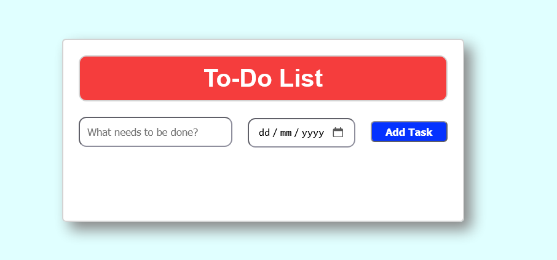
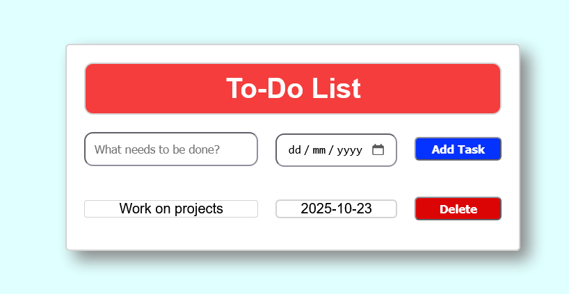

# Simple To-Do List

## Description
A simple To-Do List created using HTML5, CSS3 and JavaScript.

## Installation
### Programming Languages
HTML5 &nbsp;|&nbsp; CSS3 &nbsp;|&nbsp; JAVASCRIPT

### Extentions
- Live Preview by Microsoft.
- Live Server by Ritwick Dey.

## Usage
In the **index.html file**, click on the **Live Preview** or **Live Server** icon to preview the web page, and copy the url to your browser.

 

 

You can add a task with a date, and you can individually delete the tasks as well.

 

## Author
Nigel Feng
