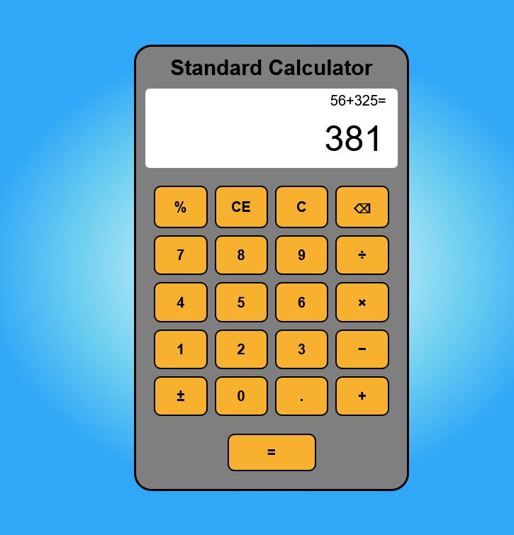
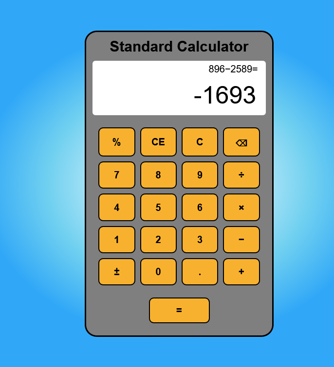
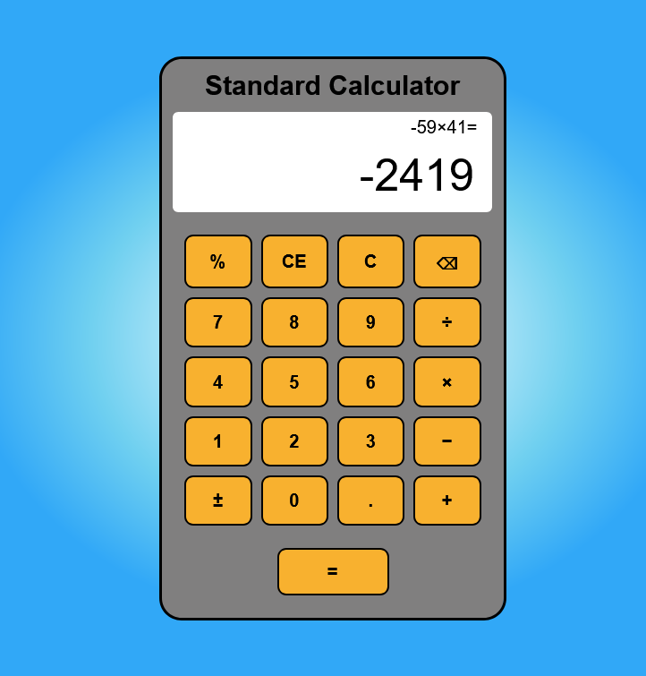
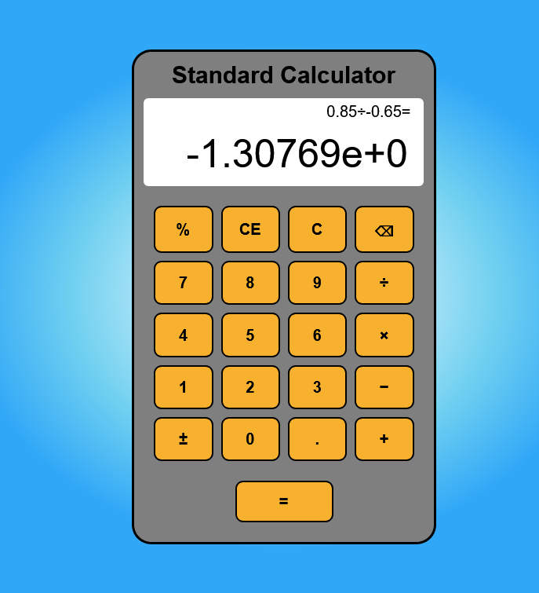

# Calculator

## Description
A Standard Calculator which can perform division, multiply, addition and subtraction as well as percentage, decimals and negative.

## Installation
### Programming Languages
HTML5 &nbsp;|&nbsp; CSS3 &nbsp;|&nbsp; JAVASCRIPT

### Extentions
- Live Preview by Microsoft.
- Live Server by Ritwick Dey.

## Usage
In the **index.html file**, click on the **Live Preview** or **Live Server** icon to preview the web page, and copy the url to your browser.

 

With this calculator you can perform the standard functions such as addition, subtraction, multiplication and division.\
If you make a mistake you can use the back button to clear digits (located on the top right corner), or clear entry (CE) to 
clear your input, and lastly to clear everything and to restart use the C button.\
Additional functions include changing the number to a percentage, decimal and negative/positive.

 &nbsp;

 
 &nbsp;

## Author
Nigel Feng
