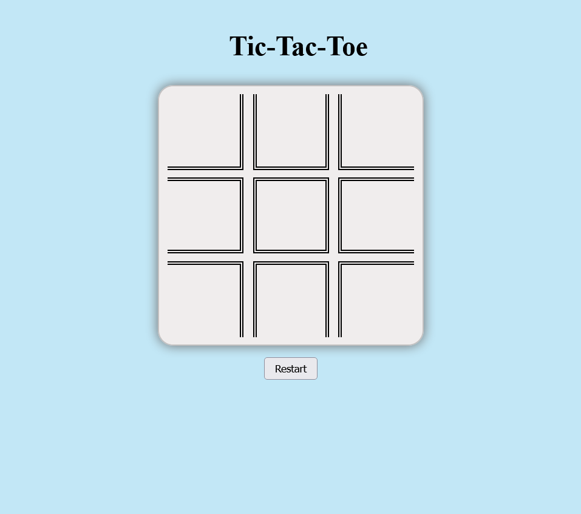
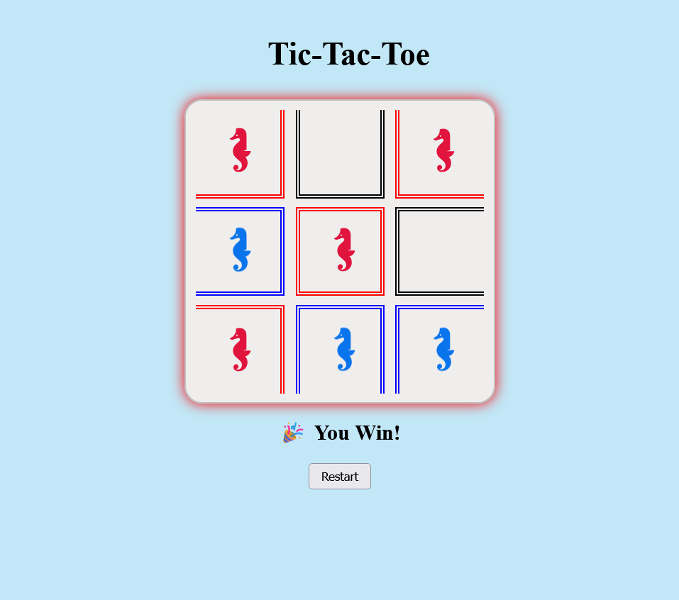
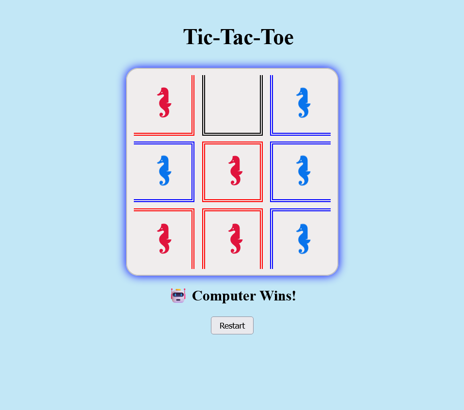
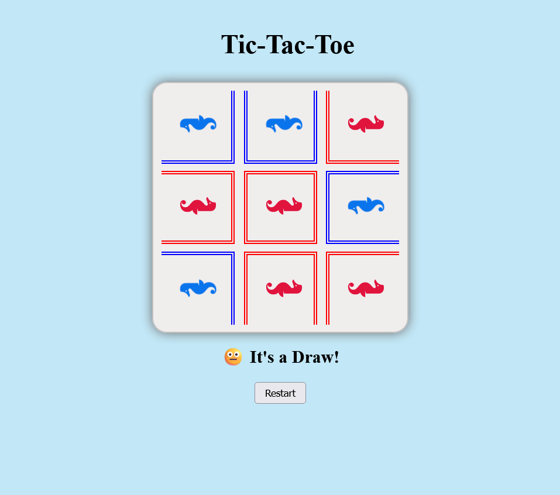

# Tic-Tac-Toe

## Description
Play a game of Tic-Tac-Toe versus a Computer.

## Installation
### Programming Languages
HTML5 &nbsp;|&nbsp; CSS3 &nbsp;|&nbsp; JAVASCRIPT

### Extentions
- Live Preview by Microsoft.
- Live Server by Ritwick Dey.

## Usage
In the **index.html file**, click on the **Live Preview** or **Live Server** icon to preview the web page, and copy the url to your browser.

Just click on one of the squares in the grid and start playing.\
Player always starts first and to restart click on the button below the grid.

 &nbsp;

 
 &nbsp;

## Author
Nigel Feng
