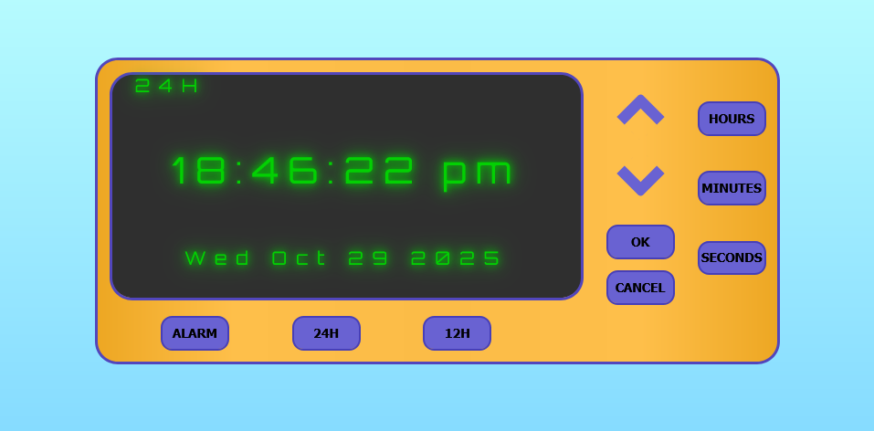
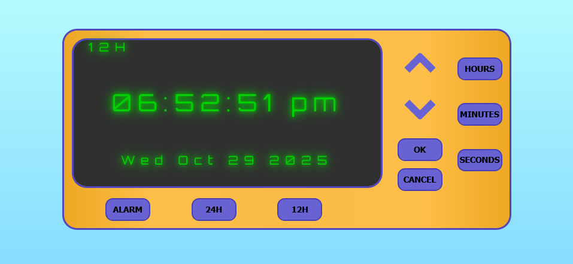
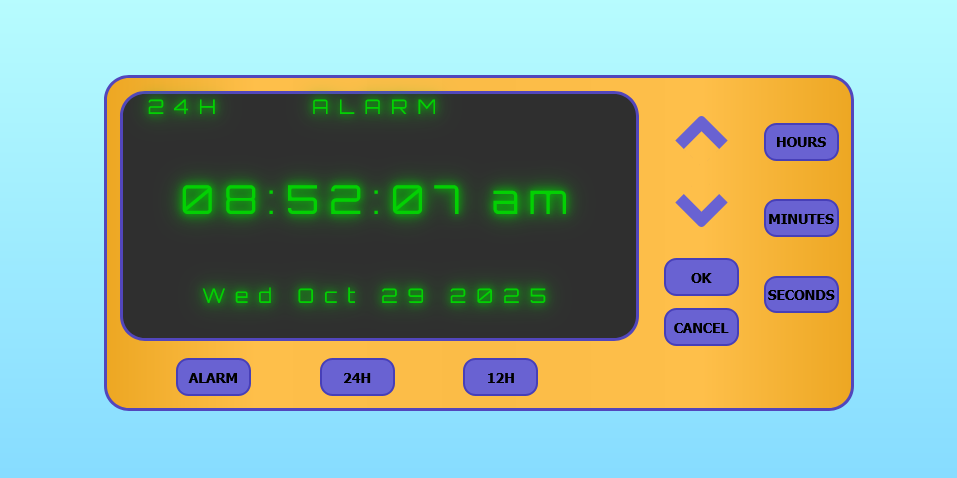
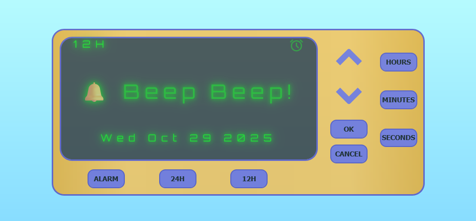

# Digital Clock

## Description
A Digital Alarm Clock that tells the time in 24 hour or 12 hour format, and can set an alarm time.

## Installation
### Programming Languages
HTML5 &nbsp;|&nbsp; CSS3 &nbsp;|&nbsp; JAVASCRIPT

### Extentions
- Live Preview by Microsoft.
- Live Server by Ritwick Dey.

## Usage
In the **index.html file**, click on the **Live Preview** or **Live Server** icon to preview the web page, and copy the url to your browser.

**Warning** : When the alarm goes off the screen flashes rapidly.\
To disable the animation, comment out lines 78 - 118.

**Buttons:**
- **24-Hour and 12-Hour** : Sets the clock to it's respective formats.

- **Alarm** : Click and it'll take you to Alarm Mode where you can set the alarm. The alarm can be set in 24-Hour or 12-Hour format.\
&nbsp; 1. Set the alarm by first clicking on one of the time options (Hours, Minutes, Seconds), followed by the **Arrow Buttons** to increase or decrease time.\
&nbsp; 2. Once done, click the **OK Button** to set the alarm.\
&nbsp; 3. If you want to cancel the Alarm, click on the **CANCEL Button**. The alarm should reset and cancel.

 

 &nbsp;

 
 &nbsp;

## Author
Nigel Feng
