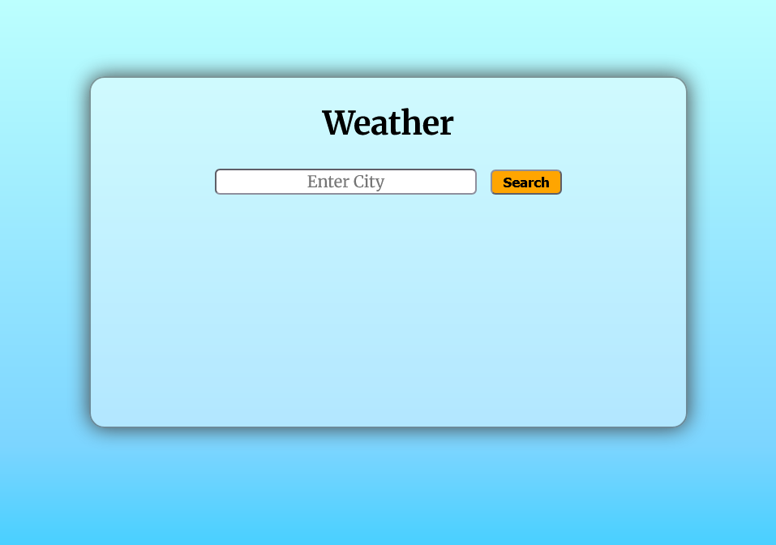
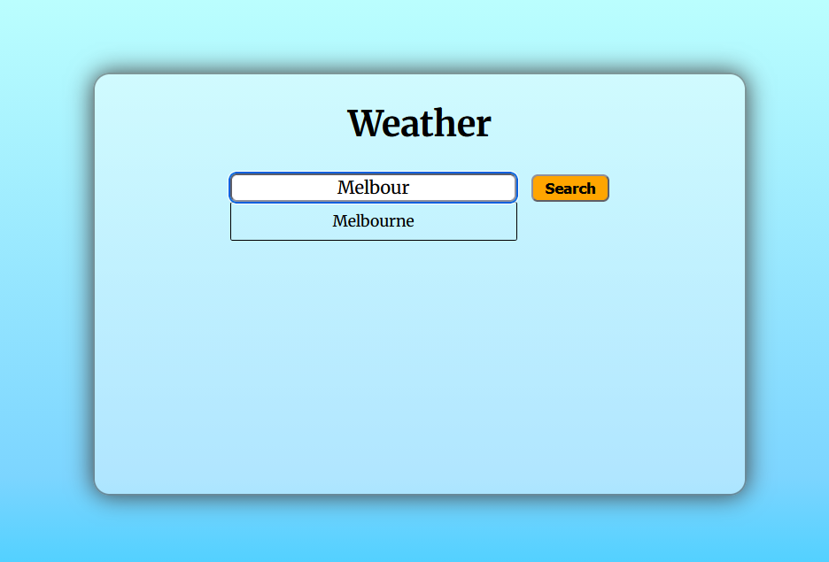
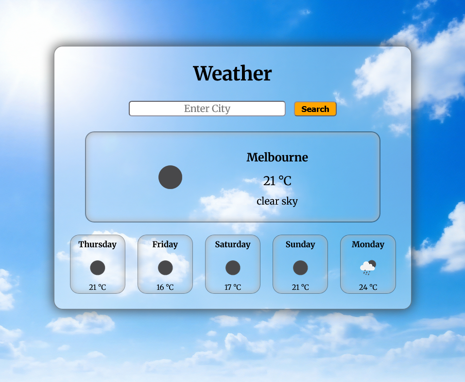
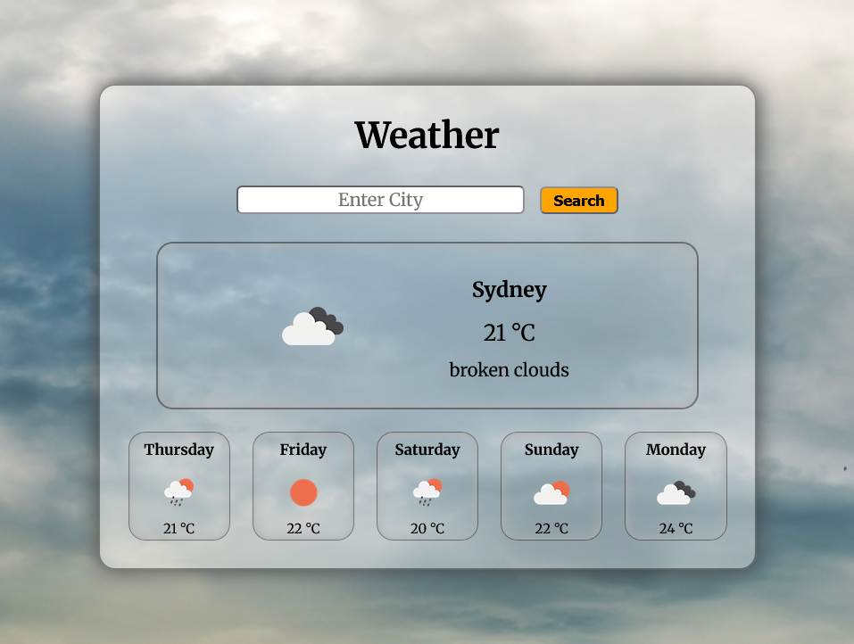

# Weather App

## Description
A Weather App using [OpenWeatherMap API](https://openweathermap.org/).

## Installation
### OpenWeatherMap Weather API
You will need to signup to obtain an API Key.
https://openweathermap.org/

Current Weather Data:
https://openweathermap.org/current

5 Day Weather Forecast Data:
https://openweathermap.org/forecast5#name5

### Programming Languages
HTML5 &nbsp;|&nbsp; CSS3 &nbsp;|&nbsp; JAVASCRIPT

### Extentions
- Live Preview by Microsoft.
- Live Server by Ritwick Dey.

## Usage
In the **index.html file**, click on the **Live Preview** or **Live Server** icon to preview the web page, and copy the url to your browser.

 

In the Weather App you can enter a city you are looking for and click on the **Search Button** to display the city's current and forecasted weather.

**Note:** A dropdown menu will only display Australia's major cities (Sydney, Melbourne, Brisbane, Perth, Adelaide, Hobart, Canberra and Darwin).

 

 &nbsp;

 
 &nbsp;

## Author
Nigel Feng
