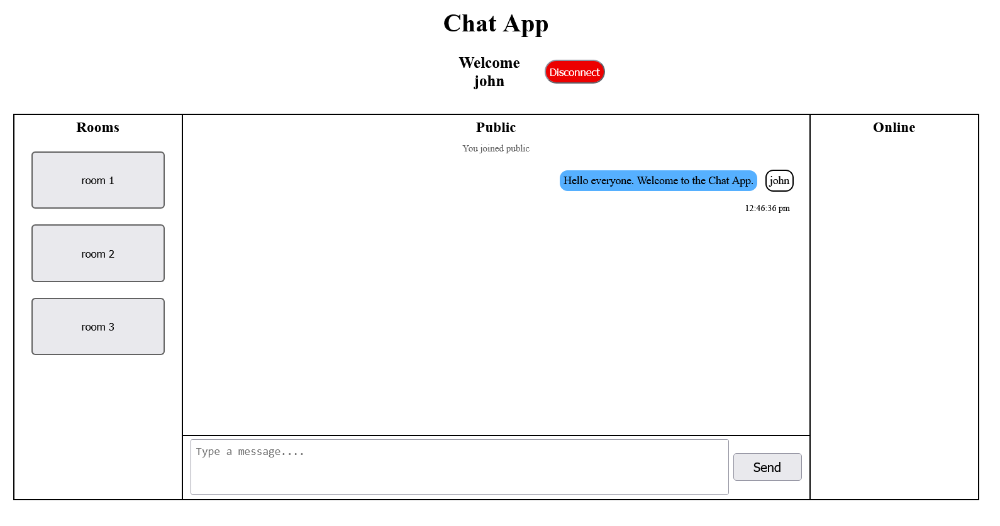
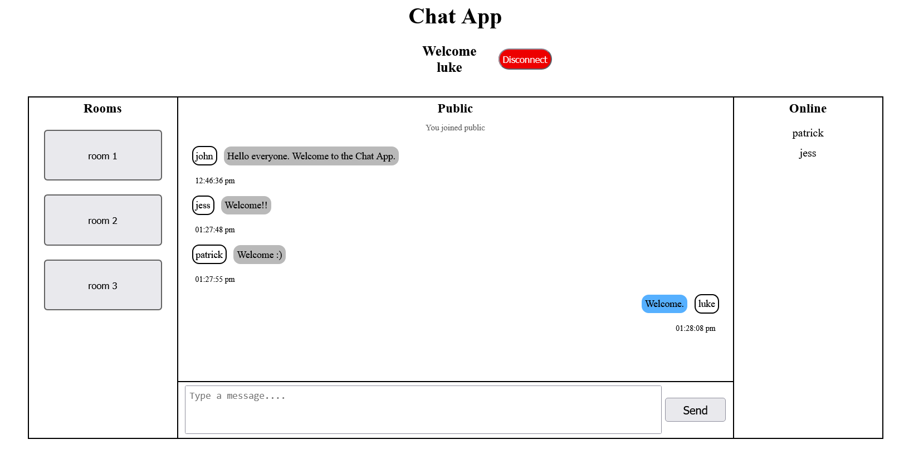

# Real-Time Chat App

## Description
A Real-time Chat App built using Socket.io. You're able to talk to other people on the same server (localhost only) and you can go into three different rooms to have a group chat.
The app uses MySQL to keep and restore conversation history when an user leaves a room or enters into a new room.

## Installation
### Programming Languages
HTML5 &nbsp;|&nbsp; CSS3 &nbsp;|&nbsp; JAVASCRIPT

### Runtime Environment & Frameworks
NODE JS &nbsp;|&nbsp; EXPRESS JS

Optional Utility: Nodemon

### DataBase (Optional)
MYSQL

### Extentions
- Live Preview by Microsoft.
- Live Server by Ritwick Dey.

## Usage
In the **index.html file**, click on the **Live Preview** or **Live Server** icon to preview the web page, and copy the url to your browser.\
Alternatively, you can run `npm start` from your terminal and type `http://localhost:"your port number"/` into your browser.

 

To begin using the Chat App, enter an user name and click connect.\
There you can start messaging at the bottom bar and click send to post.\
That's all you need to do.

 

 &nbsp;

 
 &nbsp;

## Author
Nigel Feng
